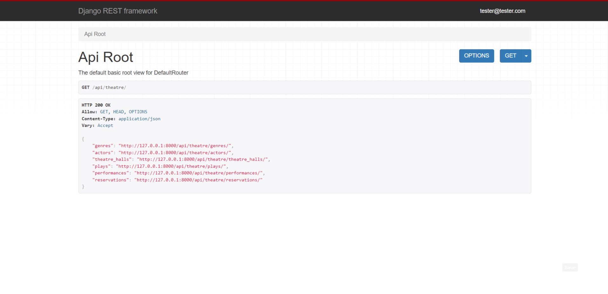

# Theatre-Api-Service
The idea is to allow visitors of the Theatre to make Reservations online and choose needed seats, without going physically to the Theatre.
## DB Structure


## Installation
Python3 must be already installed

```shell
git clone https://github.com/svitlana-savikhina/theatre-api-service
cd theatre-api-service
python3 -m venv venv
source venv/bin/activate
pip install -r requirements.txt
python manage.py migrate
python manage.py runserver #starts Django Server
```
Create .env file in root directory, define environment variables in it (example you can find in .env_sample)

## Run command
```shell
docker-compose up
```

## Features
* Using jwt fut authentication
* Using the Spectacular documentation generation component, the documentation provides detailed information about the endpoints, requests and responses that are associated with working with our API.
* Strong Django admin panel 

## Demo



